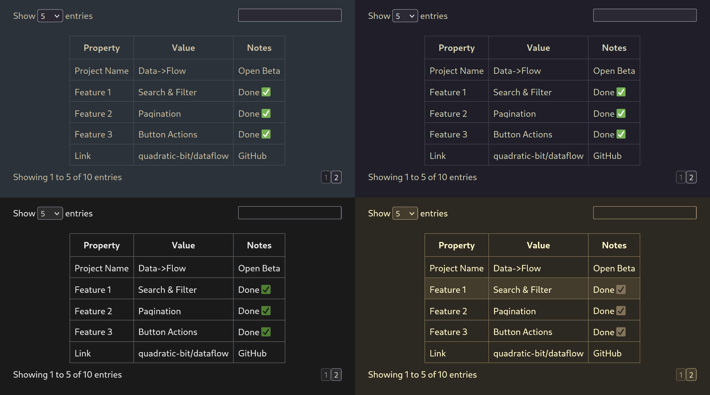

Data->Flow
---------

Dependency-free TypeScript library designed to make your HTML tables interactive.

Flow" />

### Getting started

#### Installation

##### NPM package

You can install latest stable release with your favourite package manager:

```console
$ yarn add @ashooww/dataflow # npm install @ashooww/dataflow
```

##### Building from source

To build the package from source, first clone the repository:

```console
$ git clone git@github.com:quadratic-bit/dataflow.git
$ cd ./dataflow
```

... then build it with a package manager:

```console
$ yarn build # npm run build
```

You can now reference it in `package.json` of your project like this:

```json
"dependencies": {
    "dataflow": "link:<path_to_dataflow>"
}
```

#### Usage

Getting started is fairly trivial.

1. Declare an interface of a table row:

```ts
interface Person {
    full_name: string,
    age: number,
}
```

2. Create a common `TableCollection`, specify its selector and a callback to retrieve data from:

```ts
import { TableCollection } from "dataflow"

async function tableGetter(action: string): Promise<Person[]> {
    const response = await fetch("https://example.com/api?action=" + action)
    return await response.json()
}

let collection = new TableCollection({
    mount: "main#my-table",
    receiver: tableGetter
})
```

3. Add your table within a `collection`, describing each column to display (and maybe an action):

```ts
import { actionDelete } from "dataflow/actions"

let table = collection.new<Person>({
    id: "group",
    init: "get_group",
    columns: [
        { name: "full_name", type: "text" },
        { name: "age", type: "number" }
    ],
    actions: [
        actionDelete(async () => console.log("Some row has been deleted"))
    ]
})
```

4. Voilà! There should be a pretty table at `main#my-table`
filled with data pulled from `https://example.com/api?action=get_group`.

For more info, tips and tricks please refer to the
[documentation website](https://quadratic-bit.github.io/dataflow/).

### Contributing

Your contributions are always welcome and highly appreciated.
Please have a look at the [contribution guidelines](.github/CONTRIBUTING.md)
and [Conventional Commits](https://www.conventionalcommits.org/en/v1.0.0/) for details.

### License

This project is released under the GPLv3 [license](LICENSE).
