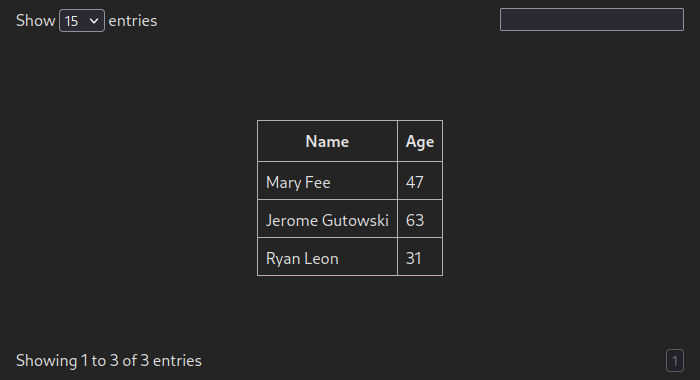

# Quick Start

### Minimal setup

#### Stylesheet

Before we touch any TypeScript, dataflow stylesheet needs to be included on the page:

```html
<head>
    <!-- metas titles and links-->
    <link rel="stylesheet" href="node_modules/dataflow/dist/css/dataflow.css" />
</head>
```

... or at the start of your `.ts` file:
```ts
import "../node_modules/dataflow/dist/css/dataflow.css"
```

#### Create the first table

Firstly, let's pick a simple interface to work with:

```ts
interface Person {
    name: string,
    age: number,
}
```

Then, we'll need to define a table collection.
The signature for the constructor is as follows:

```ts
TableCollection(
    mount: string, // HTML selector
    getter: (query: any) => Promise<any>, // Callback for retrieving data
    // locale?: Locale
)
```

So, let's define both collection and our first table:

```ts
import { TableCollection } from "dataflow"

let collection = new TableCollection("tag#id", async (query: string) => { ... })
let table = collection.new<Person>("group", "get_group").init()
```

Data retrieval callback allows user-defined implementations, e.g, using js `fetch`:

```ts
async function tableGetter(action: string): Promise<any> {
    const response = await fetch("https://example.com/api?action=" + action)
    return await response.json()
}

let collection = new TableCollection("tag#id", tableGetter)
```

The [Tauri](https://tauri.app/) equivalent would be just passing `invoke`
function to a getter:

```ts
import { invoke } from "@tauri-apps/api"

let collection = new TableCollection("tag#id", invoke)
```

:::info

The action that will be passed to a user specified getter is determined by
the second argument of a `Table` constructor, `"get_group"` in our case:

```ts
// class TableCollection {
new<Row>(
    id: string, // Unique table identifier
    init: string, // Will be passed to `getter`
    title?: string // Human-readable table title, defaults to `id`
): TableFactory<Row>
// }
```

:::

But the table isn't showing up! That's because the script didn't *describe*
the columns.


For every column that needs to be displayed, add `.describe()` in a
table initialization section.

```ts
let table = collection.new<Person>("group", "get_group")
    // highlight-start
    .describe({ name: "name", type: "text" })
    .describe({ name: "age", type: "number" })
    // highlight-end
    .init()
```

:::note

Make sure that value in a `name` field mathches with an actual property of
a described object.

:::



Great! The complete code for the setup:

```ts
import "../node_modules/dataflow/dist/css/dataflow.css"
import { TableCollection } from "dataflow"

interface Person {
    name: string,
    age: number,
}

let collection = new TableCollection("main", async (query: string) => { ... })
let table = collection.new<Person>("group", "get_group")
    .describe({ name: "name", type: "text" })
    .describe({ name: "age", type: "number" })
    .init()
```

It's also possible to imperatively add rows to our table:

```ts
table.add([...])
```

#### Frame components

Mount point of the table specified in `TableCollection` will be referred to as
a "frame", as it has more components than just a table. By default, it includes:
- Search bar (top right corner)
- Status span (bottom left corner)
- Pagination (the remaining two corners)

### Modules overview 

#### dataflow

Root export contains two classes &mdash; `Table`, representing an instance of the table,
and `TableCollection` for sharing common fields and manipulating table states:

```ts
import { Table, TableCollection } from "dataflow"
```

#### dataflow/columns

The `columns` export contains classes for every implemented column:

```ts
import { TextTableColumn, NumberTableColumn, ... } from "dataflow/columns"
```

#### dataflow/fields

The `fields` export gives auxiliary function to create relations between tables
(`createDependency`), as well as functions for data retrieval from submitted form:

```ts
import { createDependency, getString, getInt, ... } from "dataflow/fields"
```

#### dataflow/pagination

The `pagination` export allows to specify possible pages amount to choose from for the user:

```ts
import { PagesSome, PagesAll } from "dataflow/pagination"

collection.new(...).pageSizes([PagesSome(10), PagesSome(50), PagesAll])
```
