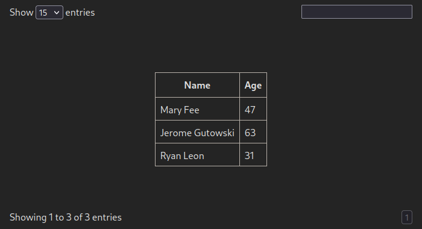
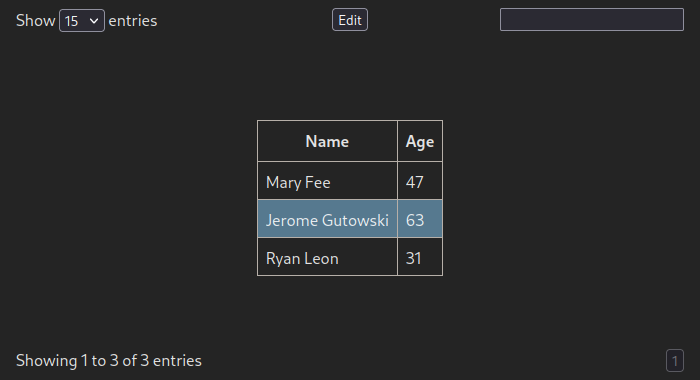
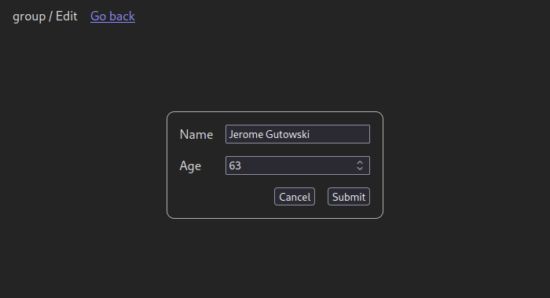
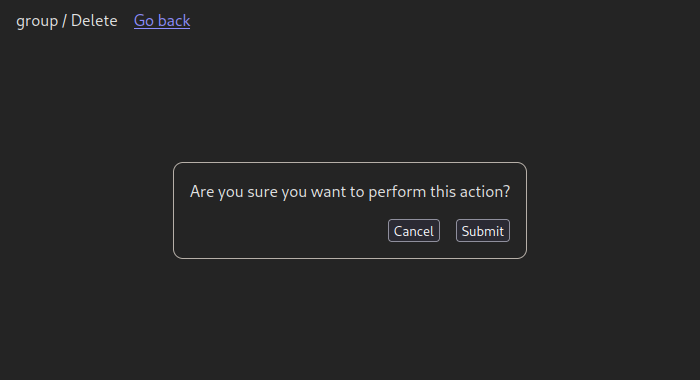

# Quick Start

### Minimal setup

#### Stylesheet

Before we touch any TypeScript, dataflow stylesheet needs to be included on the page:

```html
<head>
    <!-- metas titles and links-->
    <link rel="stylesheet" href="node_modules/dataflow/dist/css/dataflow.css" />
</head>
```

... or at the start of your `.ts` file:

```ts
import "../node_modules/dataflow/dist/css/dataflow.css"
```

#### Create the first table

Firstly, let's pick a simple interface that will represent a single table row:

```ts
interface Person {
    full_name: string,
    age: number,
}
```

Then, we'll define both collection and our first table:

```ts
import { TableCollection } from "dataflow"

let collection = new TableCollection({
    mount: "tag#id",
    receiver: async (query: string) => { ... }
})
let table = collection.new<Person>({
    id: "group",
    init: "get_group",
    columns: [
        { name: "full_name", type: "text" },
        { name: "age", type: "number" }
    ]
})
```

:::note
Make sure that value in a `name` field of each column mathches with an actual property of
a described object.
:::

Data retrieval callback allows user-defined implementations, e.g, using js `fetch`.
The function itself, as its purpose suggests, should return a list of rows:

```ts
async function tableGetter(operation: string): Promise<Person[]> {
    const response = await fetch("https://example.com/api?operation=" + operation)
    return await response.json()
}

let collection = new TableCollection({
    mount: "tag#id",
    receiver: tableGetter
})
```

:::info
The "operation" that will be passed to an above-specified getter is constant
(and often unique) for each table and is determined by the `init` argument
of a `Table` constructor, `"get_group"` in our case
:::

:::tip
The [Tauri](https://tauri.app/) equivalent would be just passing `invoke`
function as a getter:

```ts
import { invoke } from "@tauri-apps/api"

let collection = new TableCollection({
    mount: "tag#id",
    receiver: invoke
})
```
:::

You should now be seeing table filled with data,
pulled from `"https://example.com/api?operation=get_group"`



The complete code for the setup:

```ts
import "../node_modules/dataflow/dist/css/dataflow.css"
import { TableCollection } from "dataflow"

interface Person {
    full_name: string,
    age: number,
}

let collection = new TableCollection({
    mount: "tag#id",
    receiver: async (query: string) => []
})
let table = collection.new<Person>({
    id: "group",
    init: "get_group",
    columns: [
        { name: "full_name", type: "text" },
        { name: "age", type: "number" }
    ]
})

// It's also possible to imperatively add rows to the table
table.add([
    { name: "Mary Fee", age: 47 },
    { name: "Jerome Gutowski", age: 63 },
    { name: "Ryan Leon", age: 31 }
])
```

#### Adding actions

There are 3 built-in actions available: `actionAdd`, `actionEdit` and `actionDelete`,
available at `TableCollection` interface. Their differences are limited to
button text and when they are active &mdash; the rest is up to user's implementation.

To add an action, include any of those at the initialization step:

```ts
import type { Table } from "dataflow"

let table = collection.new<Person>({
    id: "group",
    init: "get_group",
    columns: [
        { name: "full_name", type: "text" },
        { name: "age", type: "number" }
    ],
    // highlight-start
    actions: [
        collection.actionEdit(async (data: FormData, table: Table<Person>) => {
            // send data to server and confirm update
            table.reinit()
            return true;
        })
    ]
    // highlight-end
})
```



(notice an "Edit" button at the top of the frame)

When this button is clicked, a form filled with row data appears.
Parameter `data` contains `FormData`, formed automatically when HTML `<form>`
is submitted:



"Edit" action activates only on row selection and fills the entire form on
spawn. "Add" action is always active and leaves all fields blank.

"Delete" action spawns a form with hidden fields and instead shows a confirmation
dialogue:



#### Frame components

Mount point of the table specified in `TableCollection` will be referred to as
a "frame", as it has more components than just a table. By default, it includes:
- Search bar (top right corner)
- Status span (bottom left corner)
- Pagination (the remaining two corners)

With some more conifguration, filters can be added as well.
