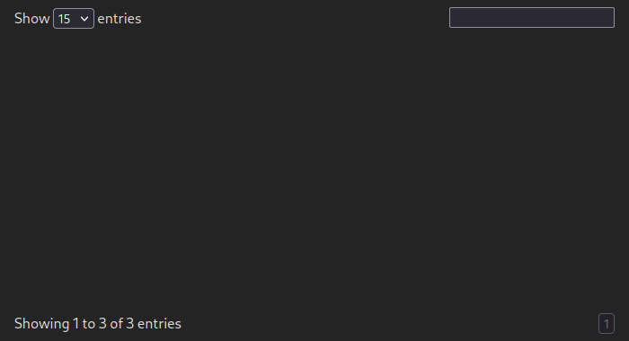

# Quick Start

### Minimal setup

#### Stylesheet

Before we touch any TypeScript, dataflow stylesheet needs to be included on the page:

```html
<head>
    <!-- metas titles and links-->
    <link rel="stylesheet" href="node_modules/dataflow/dist/css/dataflow.css" />
</head>
```

... or at the start of your `.ts` file:

```ts
import "../node_modules/dataflow/dist/css/dataflow.css"
```

#### Create the first table

Firstly, let's pick a simple interface that will represent a single table row:

```ts
interface Person {
    full_name: string,
    age: number,
}
```

Then, we'll need to define a table collection, from which tables will be derived.
The signature for the constructor is as follows:

```ts
TableCollection(
    mount: string, // HTML selector
    getter: (query: any) => Promise<any>, // Callback for retrieving data
    // locale?: Locale
)
```

So, let's define both collection and our first table:

```ts
import { TableCollection } from "dataflow"

let collection = new TableCollection("tag#id", async (query: string) => { ... })
let table = collection.new<Person>("group", "get_group").init()
```

Data retrieval callback allows user-defined implementations, e.g, using js `fetch`.
The function itself, as its purpose suggests, should return a list of rows:

```ts
async function tableGetter(operation: string): Promise<Person[]> {
    const response = await fetch("https://example.com/api?operation=" + operation)
    return await response.json()
}

let collection = new TableCollection("tag#id", tableGetter)
```

:::info
The "option" that will be passed to an above-specified getter is constant
(and often unique) for each table and is determined by the second argument `init`
of a `Table` constructor, `"get_group"` in our case:

```ts
// class TableCollection {
new<Row>(
    id: string, // Unique table identifier
    init: string, // Will be passed to `getter`
    title?: string // Human-readable table title, defaults to `id` capitalized
): TableFactory<Row>
// }
```
:::

:::tip
The [Tauri](https://tauri.app/) equivalent would be just passing `invoke`
function as a getter:

```ts
import { invoke } from "@tauri-apps/api"

let collection = new TableCollection("tag#id", invoke)
```
:::

But the table isn't showing up! That's because the script didn't *describe*
the columns it wants to render in HTML.



For every column that needs to be displayed, add `.describe()` in a
table initialization section.

```ts
let table = collection.new<Person>("group", "get_group")
    // highlight-start
    .describe({ name: "full_name", type: "text" })
    .describe({ name: "age", type: "number" })
    // highlight-end
    .init()
```

Single call would also do:

```ts
let table = collection.new<Person>("group", "get_group")
    .describe(
    // highlight-start
        { name: "full_name", type: "text" },
        { name: "age", type: "number" }
    // highlight-end
    )
    .init()
```

:::note
Make sure that value in a `name` field mathches with an actual property of
a described object.
:::


Great! The complete code for the setup:

```ts
import "../node_modules/dataflow/dist/css/dataflow.css"
import { TableCollection } from "dataflow"

interface Person {
    full_name: string,
    age: number,
}

let collection = new TableCollection("main", async (query: string) => [])
let table = collection.new<Person>("group", "get_group")
    .describe({ name: "full_name", type: "text" })
    .describe({ name: "age", type: "number" })
    .init()

// It's also possible to imperatively add rows to our table!
table.add([
    { name: "Mary Fee", age: 47 },
    { name: "Jerome Gutowski", age: 63 },
    { name: "Ryan Leon", age: 31 }
])
```

#### Adding actions

There are 3 built-in actions available: `actionAdd`, `actionEdit` and `actionDelete`.
Their differences are limited to button text and when they are active &mdash;
the rest is up to user's implementation.

To add an action, include any of those at the initialization step:

```ts
import type { Table } from "dataflow"

let table = collection.new<Person>("group", "get_group")
    .describe({ name: "name", type: "text" })
    .describe({ name: "age", type: "number" })
    // highlight-start
    .actionEdit(async (data: FormData, table: Table<Person>) => {
        // send data to server and confirm update
        table.reinit()
        return true;
    })
    // highlight-end
    .init()
```


(notice an "Edit" button at the top of the frame)

When this button is clicked, a form filled with row data appears.
Parameter `data` contains `FormData`, formed automatically when HTML `<form>`
is submitted:


"Edit" action activates only on row selection and fills the entire form on
spawn. "Add" action is always active and leaves all fields blank.

"Delete" action spawns a form with hidden fields and instead shows a confirmation
dialogue:


#### Frame components

Mount point of the table specified in `TableCollection` will be referred to as
a "frame", as it has more components than just a table. By default, it includes:
- Search bar (top right corner)
- Status span (bottom left corner)
- Pagination (the remaining two corners)
- Filter (if specified, top left corner)
